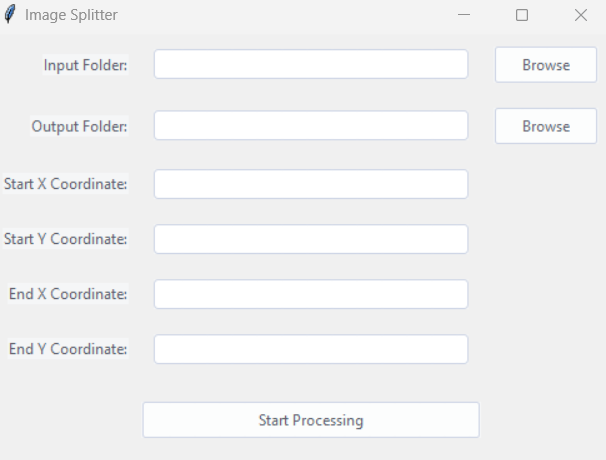

# Image-Splitter

Image Splitter is a Python program that allows you to split images into sub-images based on user-defined pixel coordinates

## Features

- Split images into sub-images with custom coordinates.
- GUI with a modern and user-friendly design.
- Easy-to-use and configurable.

## Requirements

- Python 3.6 or higher
- Pillow
- ttkthemes
